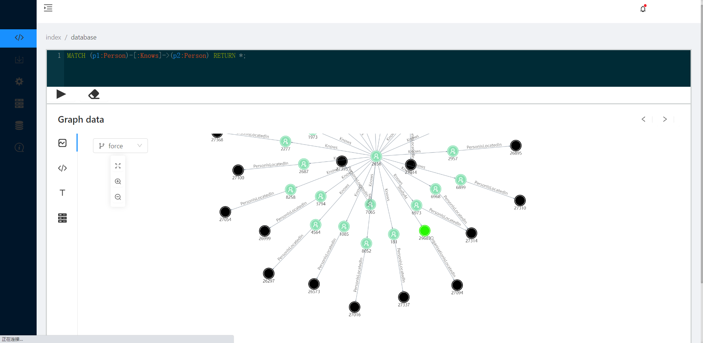

# Result data format
[result format](https://drive.google.com/file/d/1PSfjAgjhh6NhDvstO_L4YWjaEBOnVyWG/view)



<iframe width="1280" height="720" src="https://www.youtube.com/embed/UPVi3MFpZuY" title="Flink demo" frameborder="0" allow="accelerometer; autoplay; clipboard-write; encrypted-media; gyroscope; picture-in-picture; web-share" referrerpolicy="strict-origin-when-cross-origin" allowfullscreen></iframe>

# Cypher

```cypher
MATCH(p1:Person)-[r1:Knows]->(p2:Person)-[r2:PersonIsLocatedIn]-> (ct1:City), (p1:Person)-[:WorkAt]->(cp1:Company)-[:OrganisationIsLocatedIn]-> (co:Country), (p1:Person)-[:StudyAt]->(u1:University)-[:OrganisationIsLocatedIn]-> (ct2:City) RETURN *
```

```cypher
MATCH(p1:Person)-[:Knows]->(p2:Person) RETURN *;
```

```cypher
MATCH (p1:Person)-[:Knows]->(p2:Person)<-[:CommentHasCreator]-(c1:Comment)<- [:ReplyOfComment]-(c2:Comment)-[:CommentHasCreator]->(p1) RETURN *;
```

```cypher
MATCH (p1:Person)-[:Knows]->(p2:Person)-[:LikesPost]->(m:Post)- [:PostHasCreator]->(p1:Person) RETURN *;
```

```cypher
MATCH (p1:Person)<-[:PostHasCreator]-(m:Post)<-[:ReplyOfPost]-(c:Comment)- [:CommentHasCreator]->(p2:Person) RETURN *;
```

```cypher
MATCH (p1:Person)-[:Knows]->(p2:Person)-[:LikesPost]->(m:Post)- [:PostHasCreator]->(p1:Person) RETURN *;
```

```cypher
MATCH (p1:Person)<-[:PostHasCreator]-(m:Post)<-[:ReplyOfPost]-(c:Comment)- [:CommentHasCreator]->(p2:Person) RETURN *;
```

```cypher
MATCH(p1:Person)-[:Knows]->(p2:Person)<-[:PostHasCreator]-(m:Post) 2 RETURN *;
```

```cypher
MATCH (p1:Person)-[:Knows]->(p2:Person)-[w:WorkAt]->(o:Company)- [:OrganisationIsLocatedIn]->(c:Country) RETURN *;
```
